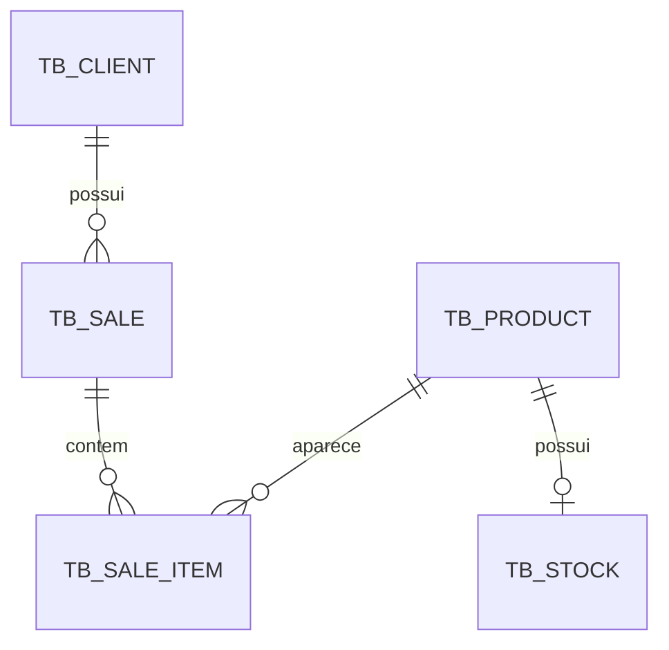

# Guia de estudo — do objeto Java à venda persistida

Este guia acompanha o projeto **EBAC — Módulo 30** e seu objetivo é explicar a implementação mais a fundo, analisando cada etapa e a construção/fluxo de toda a arquitetura.

**O projeto usa padrão JDBC puro e PostgreSQL**, sem ORM ou Spring. “JDBC puro” aqui significa que escrevemos SQL, mapeamento e controle de transações: ainda usamos o driver PostgreSQL, Dotenv e JUnit como bibliotecas.

## Como consultar

1. [Visão geral e arquitetura](#arquitetura)
2. [Configuração e execução](#execucao)
3. [Java que usamos na prática](#java)
4. [Entidades e regras de domínio](#dominio)
5. [Dinheiro com BigDecimal](#dinheiro)
6. [Tabelas, relacionamentos e redundância](#banco)
7. [Inicialização dos schemas](#schemas)
8. [JDBC: conexão, parâmetros e resultados](#jdbc)
9. [Generics e AbstractDAO](#generics)
10. [Persistência de clientes, produtos e estoque](#crud)
11. [Venda em memória e reconstrução](#venda)
12. [Transações de criação e conclusão](#transacoes)
13. [Services e montagem das dependências](#services)
14. [Controller e menus](#controller)
15. [Um fluxo completo, passo a passo](#fluxo)
16. [Testes: o que demonstram e como ler](#testes)
17. [Limites atuais e possíveis evoluções](#limites)
18. [Diagnóstico de problemas](#diagnostico)
19. [Roteiro de revisão e exercícios](#revisao)
20. [O que JPA e Spring automatizam](#spring)

<a id="arquitetura"></a>
## 1. Visão geral e arquitetura

O sistema cadastra clientes e produtos, mantém estoque e registra vendas. Uma venda começa em `INITIATED`, pode ser concluída com baixa de estoque ou cancelada mantendo seu histórico.

A evolução principal em relação a um DAO sem persistência é que os dados passam a existir independentemente do processo Java. Encerrar o programa elimina seus objetos da memória, mas as alterações confirmadas continuam no PostgreSQL.

```text
Usuário
  ↓ digita no console
AppController
  ↓ chama uma operação
Service
  ↓ delega a persistência
DAO
  ↓ executa SQL por JDBC
PostgreSQL
  ↑ devolve linhas, contagens ou erros
DAO → Service → Controller → Usuário
```

O `Main` prepara esse conjunto. Ele não precisa conter o código de cada opção de menu.

| Parte | Responsabilidade real | Exemplo |
|---|---|---|
| Domínio | Representar dados e regras dos objetos | Venda concluída não aceita novos itens |
| DAO | Executar SQL e converter linhas em objetos | Consultar produto pelo ID |
| Service | Expor as operações da aplicação; atualmente, sobretudo delegar | `productService.create(product)` |
| Controller | Interpretar entradas e apresentar resultados | Ler o preço digitado |
| Configuração | Carregar credenciais, abrir conexões e preparar tabelas | `DatabaseConfig` |
| Testes | Verificar comportamentos definidos | Falta de estoque desfaz a conclusão |

Separar camadas ajuda a localizar problemas: texto inválido pertence à entrada; linha inexistente aparece na consulta; uma transição de status envolve regra de negócio e persistência.

### Mapa dos arquivos

Todos os caminhos abaixo são relativos à raiz do projeto.

| Grupo | Arquivos para estudar |
|---|---|
| Entrada | [Main.java](src/main/java/com/fabioperettig/Main.java), [AppController.java](src/main/java/com/fabioperettig/controller/AppController.java) |
| Configuração | [DatabaseConfig.java](src/main/java/com/fabioperettig/config/DatabaseConfig.java), [ConnectionFactory.java](src/main/java/com/fabioperettig/config/ConnectionFactory.java), [SchemaInitializer.java](src/main/java/com/fabioperettig/config/SchemaInitializer.java) |
| Cadastros | [Client.java](src/main/java/com/fabioperettig/domain/Client.java), [Product.java](src/main/java/com/fabioperettig/domain/Product.java) |
| Estoque e venda | [Stock.java](src/main/java/com/fabioperettig/domain/Stock.java), [SaleItem.java](src/main/java/com/fabioperettig/domain/SaleItem.java), [Sale.java](src/main/java/com/fabioperettig/domain/Sale.java), [SaleStatus.java](src/main/java/com/fabioperettig/domain/SaleStatus.java) |
| Contrato e base DAO | [IGenericDAO.java](src/main/java/com/fabioperettig/dao/IGenericDAO.java), [AbstractDAO.java](src/main/java/com/fabioperettig/dao/AbstractDAO.java) |
| DAOs concretos | [ClientDAO.java](src/main/java/com/fabioperettig/dao/ClientDAO.java), [ProductDAO.java](src/main/java/com/fabioperettig/dao/ProductDAO.java), [StockDAO.java](src/main/java/com/fabioperettig/dao/StockDAO.java), [SaleDAO.java](src/main/java/com/fabioperettig/dao/SaleDAO.java) |
| Contrato de serviço | [IGenericService.java](src/main/java/com/fabioperettig/service/IGenericService.java) |
| Serviços | [ClientService.java](src/main/java/com/fabioperettig/service/ClientService.java), [ProductService.java](src/main/java/com/fabioperettig/service/ProductService.java), [StockService.java](src/main/java/com/fabioperettig/service/StockService.java), [SaleService.java](src/main/java/com/fabioperettig/service/SaleService.java) |
| Erro de persistência | [DataAccessException.java](src/main/java/com/fabioperettig/exception/DataAccessException.java) |
| Dependências e build | [pom.xml](pom.xml) |

`src/main/java` contém a aplicação; `src/main/resources` contém recursos distribuídos com ela; `src/test/java` contém código de teste.

<a id="execucao"></a>
## 2. Configuração e execução

O [pom.xml](pom.xml) configura compilação para Java 17 e declara:

| Dependência | Para que serve | Escopo |
|---|---|---|
| PostgreSQL JDBC | Implementar a comunicação JDBC com PostgreSQL | `runtime` |
| Dotenv | Carregar a configuração local | `compile` |
| JUnit Jupiter | Escrever e executar testes | `test` |

Podemos compilar usando as interfaces `java.sql` do Java e precisar do driver apenas ao executar. Por isso o driver tem escopo `runtime`. JUnit não é necessário para o usuário abrir o console.

O PostgreSQL precisa estar disponível e **os bancos precisam existir**. O inicializador cria estruturas dentro de um banco; ele não cria o banco em si.

Exemplo de `.env`, com valores fictícios:

```dotenv
DB_URL=jdbc:postgresql://localhost:5432/projebac3_dev
DB_USER=postgres
DB_PASSWORD=sua_senha_local

TEST_DB_URL=jdbc:postgresql://localhost:5432/projebac3_test
TEST_DB_USER=postgres
TEST_DB_PASSWORD=sua_senha_local
```

Use bancos distintos, pois os testes de integração **apagam os registros das cinco tabelas no banco de testes** e o `.env` deve ficar **fora do Git**.

### Executar e testar

No IntelliJ, abra o projeto Maven e execute `com.fabioperettig.Main`, usando a raiz do projeto como diretório de trabalho.

```bash
# Compilar o código principal
mvn compile

# Executar a suíte, incluindo PostgreSQL de testes
mvn test

# Executar somente os testes atuais de domínio e services, sem banco
mvn -Dtest=ClientServiceTest,ProductServiceTest,StockTest,SaleItemTest,SaleTest test
```

O modo `mvn -o test` funciona quando as dependências já estão no cache local. `-o` significa offline; ele não impede os próprios testes de acessarem o PostgreSQL.

`mvn -version` mostra o Java usado pelo Maven. Ele pode diferir do Java configurado no IntelliJ. O `release` do POM determina o alvo de compilação, não troca o JDK instalado.

O projeto não configura um pacote executável que reúna automaticamente todas as dependências. Não assuma que `java -jar target/...jar` substitui a execução pelo IntelliJ.

<a id="java"></a>
## 3. Java que usamos na prática

### Objetos, referências e persistência

```java
Product product = new Product();
product.setName("Cama");
product.setCode("PROD0001");
product.setPrice(new BigDecimal("250.00"));
```

Até aqui só existe um objeto Java. `setName` não executa SQL. Depois de `productDAO.create(product)`, existe também uma linha no banco e o DAO atribui o ID gerado ao objeto.

```java
Product sameProduct = product;
```

Essa atribuição copia a referência. As duas variáveis apontam para o mesmo objeto: alterar por uma aparece pela outra. Ela não consulta nem copia o banco.

```java
Product persistedProduct = productDAO.findById(product.getId())
        .orElseThrow(() -> new IllegalStateException("Produto não encontrado"));
```

Agora o DAO executa `SELECT` e monta outro objeto. Os IDs podem ser iguais, mas as referências são diferentes. Isso explica por que um teste de persistência precisa consultar novamente: verificar apenas o objeto original não prova que o banco recebeu seus dados.

### `final`, `static` e acesso

| Construção | Significado no projeto |
|---|---|
| `private` | Uso interno à classe, como validadores |
| Sem modificador | Acesso no mesmo pacote; usado nas alterações de `SaleItem` |
| `protected` | Permite especialização nos DAOs derivados, além do acesso no pacote |
| `public` | Disponível para outras camadas e pacotes |
| `static` | Membro da classe; não precisa de um objeto receptor |
| Campo `final` | A referência ou valor só recebe atribuição uma vez |
| Classe `final` | Não pode ser estendida |
| Classe `abstract` | Não pode ser instanciada diretamente; pode fornecer implementação parcial |

`private static` não significa “método para chamar pelo objeto”. O acesso privado restringe o chamador; o `static` indica que o método não depende de uma instância. Testamos a regra por uma operação acessível que chama esse validador.

`final Product product` impede trocar a referência, mas não impede `product.setName(...)`. `final` não congela profundamente um objeto.

`this` aponta para a instância atual; `this(...)` chama outro construtor da mesma classe. `super(...)`, usado pelos DAOs derivados, chama o construtor da classe base.

### `Optional`: pode existir ou não

`Optional<Product>` é um resultado que pode conter um produto. Não é um produto diretamente.

```java
Optional<Product> result = productDAO.findById(42L);

Product product = result.orElseThrow(
        () -> new IllegalArgumentException("Produto não encontrado")
);
```

A consulta ocorreu antes. A lambda cria a exceção **somente se o resultado estiver vazio**. Também podemos usar `ifPresentOrElse` para escolher entre exibir o objeto e informar ausência.

`Optional.empty()` significa consulta sem resultado. Falha de conexão gera exceção: são situações diferentes.

### Lambdas: entregar uma ação para execução posterior

```java
() -> sale.complete()
```

Os parênteses vazios dizem que a ação não recebe argumentos. O corpo chama `complete`. Quem recebe a lambda decide quando executá-la.

Uma referência como `SaleItem::getSubtotal` é uma forma curta de escrever `item -> item.getSubtotal()` quando o contexto permite.

### Coleções e streams

`List<T>` organiza elementos em sequência. `Map<Long, SaleItem>` associa cada ID a um item. `LinkedHashMap` também preserva a ordem de inserção em memória.

Em `Sale.getTotal()`:

```java
return items.values().stream()
        .map(SaleItem::getSubtotal)
        .reduce(BigDecimal.ZERO, BigDecimal::add);
```

Leia assim: obtenha os itens, transforme cada um em subtotal e some começando em zero. Isso calcula um valor; não executa uma consulta SQL.

<a id="dominio"></a>
## 4. Entidades e regras de domínio

### Client e Product

`Client` guarda `id`, `name`, `cpf` e `contact`. `Product` guarda `id`, `name`, `code` e `price`.

São classes mutáveis com getters e setters. Atualmente não validam todos os valores no setter, e os services também não acrescentam essa validação. Parte das restrições está na entrada do console e parte no banco.

Isso importa porque alguém pode chamar o DAO sem passar pelo console. Uma validação na tela melhora a experiência, mas não protege sozinha todos os pontos de entrada.

### Stock

`Stock` relaciona um produto a uma quantidade disponível. O construtor exige produto não nulo, ID não nulo e quantidade inicial não negativa.

Ter ID não nulo é uma verificação em memória. Só a chave estrangeira confirma que esse ID realmente existe no banco.

| Operação | Regra |
|---|---|
| Construção | Quantidade pode ser zero |
| `isAvailable()` | Retorna se o saldo é maior que zero |
| `hasAvailableQuantity(n)` | Exige `n > 0` e compara com o saldo |
| `increaseQuantity(n)` | Exige valor positivo e usa `Math.addExact` |
| `decreaseQuantity(n)` | Exige valor positivo e saldo suficiente |

Exemplo em memória, considerando produto com ID:

```java
Stock stock = new Stock(product, 8);
stock.decreaseQuantity(3); // saldo: 5
stock.decreaseQuantity(5); // saldo: 0, permitido
```

Essas chamadas não atualizam `TB_STOCK` sozinhas.

### SaleItem

Um item guarda produto, quantidade e **preço unitário daquela venda**. Quantidade deve ser positiva; preço deve ser não negativo.

O subtotal é calculado:

```java
unitPrice.multiply(BigDecimal.valueOf(quantity))
```

Se um item tem três unidades a `10.00`, seu subtotal é `30.00`.

`SaleItem` não permite reduzir sua quantidade a zero: um item existente precisa ter quantidade positiva. Quem remove o item inteiro é `Sale.removeProduct`.

Os métodos de alteração da quantidade têm acesso de pacote. `Sale`, no mesmo pacote, coordena as mudanças; o controller usa as operações de `Sale`.

### Overflow

Uma soma comum de `int` pode ultrapassar seu limite e produzir um resultado incorreto sem lançar exceção. `Math.addExact` detecta esse caso e lança `ArithmeticException`.

```java
int quantity = Math.addExact(Integer.MAX_VALUE, 1); // lança exceção
```

A atribuição não se completa. Assim, uma expressão como `quantity = Math.addExact(quantity, amount)` preserva o campo anterior quando a soma falha.

O projeto usa essa proteção em aumentos de estoque e de item. Ela não cobre automaticamente todos os cálculos: a soma de quantidades de vários itens em `Sale.getTotalQuantity()` ainda usa `int` com `sum()`.

### SaleStatus e Sale

```text
INITIATED ── concluir com itens ──> COMPLETED
     └────── cancelar ───────────> CANCELLED
```

`canBeModified()` permite alterações somente em `INITIATED`. `Sale` verifica essa regra antes de adicionar, remover, concluir ou cancelar.

| Estado atual | Alterar itens em memória | Concluir | Cancelar |
|---|---|---|---|
| `INITIATED` | Sim | Sim, com itens | Sim |
| `COMPLETED` | Não | Não | Não |
| `CANCELLED` | Não | Não | Não |

Cancelar mantém os itens. Eles descrevem o que foi cancelado, permitindo consulta do histórico. Apagar itens tornaria impossível reconstruir essa informação.

No fluxo atual, só a conclusão baixa estoque. Portanto cancelar uma venda iniciada não precisa devolver unidades. Cancelar uma venda já concluída exigiria outra operação de negócio, como estorno, que não foi implementada.

<a id="dinheiro"></a>
## 5. Dinheiro com BigDecimal

### Por que usar `new BigDecimal("10.00")` no setter?

`setPrice` recebe um objeto `BigDecimal`. A expressão cria esse objeto e entrega sua referência ao método:

```java
product.setPrice(new BigDecimal("10.00"));
```

É equivalente a:

```java
BigDecimal price = new BigDecimal("10.00");
product.setPrice(price);
```

O setter não exige uma “sintaxe especial”. Ele exige o tipo correto. Se já houver um `BigDecimal`, basta passá-lo; não é necessário criar outro a cada chamada.

### Por que passar uma String?

Literais como `0.1` são `double`, cuja representação binária não expressa exatamente muitos números decimais. `new BigDecimal(0.1)` recebe essa aproximação.

`new BigDecimal("0.1")` interpreta diretamente o texto decimal. Por isso usamos strings para valores monetários fixos e o texto digitado no console.

### Imutabilidade e comparação

`BigDecimal` é imutável: operações devolvem resultados, não alteram o objeto existente.

```java
BigDecimal total = new BigDecimal("10.00");
total.add(new BigDecimal("5.00")); // resultado ignorado
// total continua 10.00

total = total.add(new BigDecimal("5.00")); // agora 15.00
```

`equals` considera valor e escala. `10.0` e `10.00` têm escalas diferentes. Para comparar apenas o valor numérico:

```java
boolean sameValue = new BigDecimal("10.0")
        .compareTo(new BigDecimal("10.00")) == 0;
```

Nos testes, `assertEquals` de dois `BigDecimal` usa `equals`. Se a escala faz parte do esperado, isso é útil; caso contrário, compare numericamente.

### Preço histórico

```java
product.setPrice(new BigDecimal("10.00"));
SaleItem item = new SaleItem(product, 3);
product.setPrice(new BigDecimal("12.00"));

// item.getUnitPrice(): 10.00
// item.getSubtotal(): 30.00
// item.getProduct().getPrice(): 12.00
```

O item guardou a referência ao `BigDecimal` original, que é imutável. Trocar o preço do produto não troca o campo `unitPrice` do item.

Isso não congela o produto inteiro. Nome, código e outros dados do produto continuam sendo dados atuais; o histórico preservado explicitamente é o preço do item.

### Zero, escala e regras futuras

Preço zero é permitido no console, em `SaleItem` e nas restrições SQL atuais. Portanto um produto pode ser gratuito. Se a regra desejada fosse “sempre maior que zero”, precisaríamos ajustar os pontos de validação e o banco de forma coerente.

`NUMERIC(10,2)` suporta dez dígitos no total, com duas casas decimais. `BigDecimal` não impõe sozinho esse limite. O console aceita mais casas; o banco pode arredondar ao persistir. Uma evolução seria rejeitar escalas incompatíveis ou aplicar uma política explícita de arredondamento antes da gravação. [Precisão e escala no PostgreSQL](https://www.postgresql.org/docs/current/datatype-numeric.html).

<a id="banco"></a>
## 6. Tabelas, relacionamentos e redundância

### Estruturas atuais

| Tabela e arquivo | Colunas principais | Restrições relevantes |
|---|---|---|
| [TB_CLIENT](src/main/resources/database/schemaClient.sql) | `id`, `name_client`, `cpf_client`, `contact_client` | ID primário; CPF único; campos obrigatórios |
| [TB_PRODUCT](src/main/resources/database/schemaProduct.sql) | `id`, `name_product`, `code_product`, `price_product` | Código único; preço não negativo |
| [TB_STOCK](src/main/resources/database/schemaStock.sql) | `product_id`, `available_quantity` | Produto é PK e FK; quantidade não negativa |
| [TB_SALE](src/main/resources/database/schemaSale.sql) | `id`, `code_sale`, `client_id`, `sale_date`, `status_sale` | Código único; cliente existente; status restrito |
| [TB_SALE_ITEM](src/main/resources/database/schemaSaleItem.sql) | `sale_id`, `product_id`, `quantity`, `unit_price` | PK composta; referências válidas; quantidade positiva; preço não negativo |

Os IDs de cliente, produto e venda usam sequências. Estoque reaproveita o ID do produto. Item é identificado pelo par venda/produto.



Leia: um cliente pode ter várias vendas; um produto pode ter zero ou um registro de estoque; cada item pertence a uma venda e referencia um produto. A estrutura SQL permite venda sem itens, embora a conclusão a rejeite.

### PK, FK, UNIQUE, NOT NULL e CHECK

- **PRIMARY KEY:** identifica uma linha sem repetição e sem nulo.
- **FOREIGN KEY:** exige referência a uma linha existente.
- **UNIQUE:** impede repetição, como dois produtos com o mesmo código.
- **NOT NULL:** impede ausência de valor; não rejeita automaticamente texto vazio.
- **CHECK:** valida uma expressão, como `quantity > 0`.

Um `VARCHAR(11)` não valida matematicamente um CPF. Limite de tamanho, obrigatoriedade e validade de documento são regras diferentes.

A PK composta `(sale_id, product_id)` impede duas linhas para o mesmo produto na mesma venda. Isso acompanha a escolha do domínio de acumular quantidades em um único item.

### Por que separar produto e estoque?

Produto descreve o cadastro: nome, código e preço. Estoque representa saldo disponível. Se o saldo também estivesse em produto, uma atualização poderia deixar duas quantidades diferentes para o mesmo fato.

Hoje existe uma fonte para o saldo: `TB_STOCK.available_quantity`. `isAvailable()` deriva a disponibilidade desse número, evitando outro campo que poderia ficar incoerente.

A FK não cria estoque automaticamente. Produto sem registro de estoque e produto com saldo zero são situações diferentes. O console oferece uma opção para cadastrar o saldo inicial.

### Por que repetir o preço no item não é redundância problemática?

`price_product` significa preço atual do catálogo. `unit_price` significa preço usado naquela venda. São fatos distintos, mesmo quando inicialmente iguais.

Já o total da venda é calculado pelos itens, sem coluna própria. Isso elimina a necessidade de sincronizar um total armazenado com cada alteração dos itens.

### O que acontece ao excluir?

| Exclusão | Resultado |
|---|---|
| Produto sem itens de venda | Seu estoque é removido em cascata |
| Somente estoque | Produto continua cadastrado |
| Produto referenciado por item | FK bloqueia a exclusão |
| Cliente referenciado por venda | FK bloqueia a exclusão |
| Venda, por exclusão SQL direta | Seus itens são removidos em cascata |
| Cancelamento pelo sistema | Apenas status muda; itens permanecem |

Não há operação de exclusão de venda no DAO ou no menu. A cascata da tabela é uma propriedade do banco, não uma opção automaticamente criada na aplicação.

Como vendas canceladas mantêm os itens, suas referências continuam bloqueando a exclusão dos respectivos produtos e clientes.

Sequências não prometem IDs consecutivos sem buracos. Uma tentativa revertida pode consumir um número. O ID identifica; não é contador confiável de registros.

<a id="schemas"></a>
## 7. Inicialização dos schemas

`DatabaseConfig` carrega valores e constrói uma `ConnectionFactory`. A fábrica guarda a configuração e chama `DriverManager.getConnection(...)` quando uma conexão é solicitada.

`SchemaInitializer.initialize()`:

1. Abre uma conexão.
2. Desativa autocommit.
3. Lê os SQLs dos resources.
4. Executa cliente, produto, venda, item e estoque, nessa ordem.
5. Confirma o conjunto com `commit`, ou tenta `rollback` em falha.

A ordem respeita as dependências: uma tabela referenciada precisa existir antes da FK que a utiliza.

`getResourceAsStream` lê recursos pelo classpath, permitindo que sejam encontrados na estrutura de execução do Java. Não depende de abrir diretamente um caminho absoluto do computador do autor.

Os scripts usam `IF NOT EXISTS`. Reiniciar a aplicação pode executar os comandos novamente sem tentar recriar as estruturas existentes, mas isso **não atualiza uma tabela antiga** quando você edita a definição no arquivo.

O executor divide o texto por `;`. É suficiente para nossos scripts simples; não é um interpretador geral para funções SQL, strings com ponto e vírgula ou migrations complexas.

<a id="jdbc"></a>
## 8. JDBC: conexão, parâmetros e resultados

JDBC oferece interfaces padronizadas. O driver PostgreSQL implementa a comunicação necessária com o banco escolhido.

| Tipo | Papel |
|---|---|
| `Connection` | Sessão com o banco; contexto das operações e transação |
| `PreparedStatement` | Comando com parâmetros |
| `ResultSet` | Cursor sobre linhas retornadas |
| `SQLException` | Falha reportada pela operação JDBC |

### PreparedStatement e índices

Recorte didático, com `connection` e `product` já disponíveis:

```java
String sql = "UPDATE tb_product SET price_product = ? WHERE id = ?";

try (PreparedStatement statement = connection.prepareStatement(sql)) {
    statement.setBigDecimal(1, product.getPrice());
    statement.setLong(2, product.getId());
    int affectedRows = statement.executeUpdate();
}
```

Os parâmetros começam em **1**, seguindo a ordem dos `?`. A ordem dos campos Java não determina essa posição.

Passamos valores pelos setters em vez de concatenar entrada no SQL. Assim, o conteúdo é tratado como dado. Um placeholder não representa nome de tabela ou palavra-chave: ele representa um valor.

### Query e update

`executeQuery()` retorna um `ResultSet`, normalmente de um `SELECT`. `executeUpdate()` retorna a quantidade de linhas afetadas por `INSERT`, `UPDATE` ou `DELETE`.

No CRUD do projeto, `update` e `deleteById` retornam `true` quando a contagem é um. Uma consulta sem resultado devolve vazio; uma alteração sem linha correspondente devolve `false`.

### O cursor começa antes da primeira linha

```java
try (ResultSet resultSet = statement.executeQuery()) {
    while (resultSet.next()) {
        Product product = mapRow(resultSet);
        products.add(product);
    }
}
```

`next()` avança e informa se existe linha. `mapRow` lê a linha atual: não deve avançar novamente, pois pularia registros.

Para buscar por ID basta `if`, porque esperamos no máximo uma linha. Para listar usamos `while`.

### try-with-resources

```java
try (Connection connection = connectionFactory.getConnection();
     PreparedStatement statement = connection.prepareStatement(sql)) {
    // Executar a operação.
}
```

Os recursos são fechados automaticamente ao sair do bloco, inclusive em exceções, na ordem inversa de criação. Isso evita deixar conexões e cursores abertos.

Fechar recurso e desfazer transação são responsabilidades distintas. Onde há transação manual, o código chama explicitamente `commit` ou `rollback`.

### ID gerado

O insert solicita `Statement.RETURN_GENERATED_KEYS`. Depois da execução, o DAO obtém `getGeneratedKeys()`, chama `next()`, lê o ID e o atribui à entidade.

Isso não significa descobrir o maior ID da tabela: o resultado está associado à operação executada, evitando confundir inserções de outros usuários.

### Exceções

Nossa `DataAccessException` estende `RuntimeException` e preserva a causa recebida. Ela permite que camadas superiores tratem uma falha de persistência sem declarar `throws SQLException` em todo método.

É uma classe do projeto, não a classe de mesmo nome do Spring. O controller apresenta mensagem simples, enquanto a causa preservada permite diagnosticar o erro no depurador ou em tratamento adicional.

<a id="generics"></a>
## 9. Generics e AbstractDAO

### O contrato

```java
public interface IGenericDAO<T, ID> {
    T create(T entity);
    Optional<T> findById(ID id);
    List<T> findAll();
    boolean update(T entity);
    boolean deleteById(ID id);
}
```

`T` representa o tipo da entidade; `ID`, seu identificador. Em `IGenericDAO<Product, Long>`, o compilador interpreta os métodos como operações de produto com ID `Long`.

Isso permite reutilizar a estrutura com checagem de tipos. Não precisamos aceitar `Object` e fazer casts por conta própria.

### Interface versus classe abstrata

A interface define o que deve ser oferecido. `AbstractDAO` implementa o fluxo comum, mas deixa detalhes para as subclasses.

```java
public class ProductDAO extends AbstractDAO<Product, Long> {
    // SQLs, binds, mapeamento e tratamento do ID específicos de Product.
}
```

O padrão costuma ser chamado de **Template Method**: o esqueleto do algoritmo está na base; alguns passos são fornecidos pela especialização.

| Gancho do AbstractDAO | Responsabilidade do DAO concreto |
|---|---|
| `getInsertSql()` e demais getters SQL | Escolher tabela e colunas |
| `bindInsert(statement, entity)` | Preencher os parâmetros do insert |
| `bindUpdate(statement, entity)` | Preencher os valores e o ID do update |
| `bindId(statement, id)` | Preencher o ID da busca ou exclusão |
| `mapRow(resultSet)` | Construir a entidade a partir da linha |
| `readGeneratedId(generatedKeys)` | Ler o identificador no tipo correto |
| `setGeneratedId(entity, id)` | Atribuir o identificador à entidade |

O `create` da base não sabe que existe `name_product`. Ele chama `bindInsert`, que sabe. Essa divisão permite reusar gerenciamento de recursos e tratamento de exceções sem fingir que todas as entidades têm os mesmos campos.

### Caminho do create

```text
ProductDAO herda create
  → AbstractDAO abre conexão
  → ProductDAO fornece SQL
  → ProductDAO preenche parâmetros
  → AbstractDAO executa e verifica contagem
  → ProductDAO lê e atribui ID
  → AbstractDAO retorna a entidade
```

O método executado é definido pelo objeto concreto, mesmo quando a variável foi declarada como interface. Esse é o uso de polimorfismo no projeto.

### A abstração tem um limite

O estoque não gera ID próprio; por isso seu DAO implementa a interface diretamente. A venda exige gravar várias tabelas e controlar transições; seu DAO oferece operações específicas, sem implementar o CRUD genérico.

Não precisamos forçar `SaleDAO` a ter `deleteById` só porque os cadastros o têm. A abstração deve representar operações que fazem sentido.

<a id="crud"></a>
## 10. Persistência de clientes, produtos e estoque

### ClientDAO e ProductDAO

Os dois especializam `AbstractDAO`. Para cada campo, acompanhe três representações:

```text
product.getPrice()
    → statement.setBigDecimal(...)
    → price_product no PostgreSQL
    → resultSet.getBigDecimal("price_product")
    → product.setPrice(...)
```

Esse vai e volta é o mapeamento objeto-relacional manual. Se adicionarmos um campo persistido, precisamos coordenar classe, schema, SQL de escrita, binds, SQL de leitura e mapeamento; depois conferir o fluxo de entrada e os testes relevantes.

Um setter seguido de `update` grava a alteração. O setter isolado só altera memória.

### StockDAO

O ID usado em `findById` é o **ID do produto**. `create` recebe um `Stock`, grava `product_id` e quantidade e não pede chave gerada.

As consultas usam `JOIN` com produto para reconstruir tanto o `Product` quanto o `Stock`. Uma linha SQL reúne os dados que o objeto precisa.

`findAll` retorna os estoques existentes, incluindo saldo zero. Não retorna automaticamente todo produto sem estoque.

O update grava um saldo absoluto:

```sql
UPDATE tb_stock
SET available_quantity = ?
WHERE product_id = ?
```

Se o saldo é cinco e você informa oito no menu de ajuste, o resultado é oito. Não é treze. A baixa de venda usa outro SQL, explicado a seguir.

<a id="venda"></a>
## 11. Venda em memória e reconstrução

### Montagem de uma venda nova

Considerando cliente e produto já cadastrados:

```java
Sale sale = new Sale("VENDA-001", client);
sale.addProduct(product, 2);
sale.addProduct(product, 1);
```

Há um único item com quantidade três. O mapa usa o ID do produto como chave; por isso objetos diferentes que representem o mesmo ID também correspondem ao mesmo item.

Adicionar novamente mantém o preço capturado na primeira inclusão. O preço atual do catálogo não substitui silenciosamente o preço daquele item.

`removeProduct(product, quantity)` pode diminuir a quantidade ou remover a entrada do mapa quando a quantidade solicitada é exatamente a existente.

### Coleção protegida não significa cópia profunda

`getItems()` retorna `List.copyOf(items.values())`. O chamador não consegue adicionar ou remover elementos nessa lista. Porém os elementos e seus produtos não se tornam cópias profundamente imutáveis.

Esse cuidado protege a estrutura de itens, mas não torna toda a venda imutável. Em particular, alterar IDs de produtos depois da inclusão pode desalinhar o objeto com a chave guardada no mapa.

### Criação e restauração são caminhos diferentes

Uma venda nova recebe `Instant.now()` e `INITIATED`. Uma venda consultada precisa recuperar a data e o status persistidos.

`Sale.restore(...)` recebe ID, código, cliente, data, status e itens. Ele reconstrói o objeto, copia os itens com seus preços históricos e rejeita situações como produto duplicado ou venda concluída vazia.

Ele não executa SQL. O DAO busca os dados; o domínio os transforma em uma venda válida. Também não chama `complete()` para simular a história: restaura diretamente o estado fornecido após as verificações.

### Como findById reconstrói a venda

1. Consulta a venda com os dados do cliente.
2. Se não houver linha, devolve `Optional.empty()`.
3. Consulta os itens com os dados atuais dos produtos.
4. Usa `unit_price` do item para preservar o preço histórico.
5. Converte data e status e chama `Sale.restore`.

A data usa `Instant` no domínio. Na escrita, o DAO passa um `OffsetDateTime` em UTC ao driver; na leitura, volta a `Instant`. O objetivo é preservar o instante, não o fuso original de quem digitou.

A ordem em memória é a de inclusão; a consulta de itens usa `ORDER BY product_id`. Não há promessa de recuperar a ordem original de digitação.

### Memória e banco continuam separados

| Chamada | Efeito |
|---|---|
| `sale.complete()` | Muda o status do objeto em memória |
| `saleDAO.complete(id)` | Atualiza status e estoque no banco |
| `saleService.complete(id)` | Delega a operação persistida ao DAO |
| `saleDAO.findById(id)` | Reconstrói um objeto com os dados consultados |

Após concluir pelo service, uma variável antiga pode ainda mostrar `INITIATED`. Reconsulte para observar o estado persistido.

Também não há salvamento automático ao modificar itens de uma venda já criada. O fluxo implementado monta os itens antes do primeiro `create`; não oferece edição persistida posterior.

<a id="transacoes"></a>
## 12. Transações de criação e conclusão

### Por que uma transação?

Uma venda pode exigir três inserts: cabeçalho, primeiro item e segundo item. Se o segundo falhar depois de os demais terem sido confirmados separadamente, teríamos uma gravação incompleta.

Com `setAutoCommit(false)`, agrupamos as operações. `commit()` confirma o conjunto. Em falha, `rollback()` desfaz as alterações ainda não confirmadas da transação.

**As operações precisam compartilhar a mesma conexão.** Abrir outra conexão dentro de `insertItems` criaria outro contexto transacional; o rollback da primeira não desfaria a segunda.

### SaleDAO.create

```text
Validar: venda não nula, sem ID e INITIATED
  ↓
Abrir conexão e desativar autocommit
  ↓
Inserir venda → receber ID local
  ↓
Inserir todos os itens usando essa conexão e esse ID
  ↓
Commit
  ↓
Atribuir ID ao objeto e retornar

Falha dentro da transação → rollback → exceção
```

O ID só é atribuído ao objeto depois do commit. Assim, uma falha ao inserir itens não deixa o objeto marcado com o ID de uma venda revertida.

O método privado de rollback preserva a exceção original e adiciona uma eventual falha do próprio rollback como exceção suprimida. O erro inicial não se perde.

`create` aceita uma venda iniciada vazia no DAO. O controller evita salvá-la e a conclusão também rejeita ausência de itens. É útil distinguir as garantias de cada camada.

### SaleDAO.complete

A conclusão primeiro tenta mudar o status:

```sql
UPDATE tb_sale
SET status_sale = 'COMPLETED'
WHERE id = ? AND status_sale = 'INITIATED'
```

Se não afetar uma linha, a venda não existe ou já saiu do estado permitido. A operação falha sem aplicar nova baixa.

Depois lê os itens persistidos e, para cada produto, executa:

```sql
UPDATE tb_stock
SET available_quantity = available_quantity - ?
WHERE product_id = ? AND available_quantity >= ?
```

A quantidade aparece duas vezes: uma para descontar, outra para exigir saldo suficiente. Ausência de estoque e saldo insuficiente resultam em zero linhas afetadas e geram falha.

O status e todas as baixas usam a mesma conexão. O commit só vem depois de todas terem funcionado.

### Exemplo de rollback com dois produtos

| Momento | Status | Estoque A | Estoque B |
|---|---|---:|---:|
| Antes | `INITIATED` | 8 | 1 |
| Alterações tentadas na transação | `COMPLETED` | 5 | Falha ao retirar 2 |
| Após rollback | `INITIATED` | 8 | 1 |

A alteração de A não fica pela metade. O status também volta ao valor anterior.

### Por que verificar no próprio UPDATE?

O padrão “consultar saldo, verificar em Java e gravar depois” pode usar um saldo desatualizado quando duas operações ocorrem juntas.

Aqui a condição faz parte da alteração no banco. Se duas conclusões disputam saldo, cada update precisa satisfazer `available_quantity >= ?` ao efetivamente alterar a linha. A condição de status também impede concluir a mesma venda novamente.

Isso protege esses caminhos de atualização. Não significa que todo acesso concorrente do sistema esteja resolvido: um ajuste manual absoluto de estoque ainda merece tratamento próprio.

Os testes atuais demonstram rollback e bloqueio de repetição, mas não executam uma simulação concorrente com múltiplas conexões competindo.

### Cancelamento

O cancelamento faz um único update condicionado a `INITIATED`. Não remove itens nem toca em estoque. Para essa única instrução, o autocommit já confirma a operação como uma unidade.

Uma confirmação no console não substitui a condição SQL. Entre mostrar a venda e executar a ação, o estado poderia ter mudado; o banco precisa conferir novamente.

<a id="services"></a>
## 13. Services e montagem das dependências

ClientService, ProductService e StockService implementam `IGenericService` e recebem um `IGenericDAO` pelo construtor. SaleService recebe `SaleDAO` e oferece suas operações específicas.

Os services atuais são enxutos: verificam a dependência no construtor e delegam. Não escondem um conjunto de validações que ainda não foi escrito.

Por que manter essa camada? Ela cria um ponto de entrada para os casos de uso. Futuramente, validações que dependam de consultas ou coordenação de vários componentes podem morar ali.

Exemplo equivalente à montagem feita pelo `Main`:

```java
ProductDAO productDAO = new ProductDAO(connectionFactory);
ProductService productService = new ProductService(productDAO);
```

Isso já é **injeção de dependência por construtor**. A classe recebe o colaborador em vez de criá-lo internamente. Spring não é necessário para aplicar essa ideia.

Nos testes, podemos entregar um DAO falso que implemente a mesma interface. A classe de serviço continua fazendo a mesma chamada sem precisar conhecer PostgreSQL.

O `Main` carrega a configuração, inicializa schemas, monta DAOs e services, cria um `Scanner` e inicia o controller. Ele não descobre novos menus “sozinho”: as opções estão programadas no controller, e mudanças precisam ser compiladas e executadas novamente.

<a id="controller"></a>
## 14. Controller e menus

Nosso controller é de console. Ele não é um controller HTTP e não tem rotas web.

```text
Menu principal
├─ Clientes
│  ├─ Cadastrar / Buscar por ID / Listar
│  └─ Alterar / Excluir
├─ Produtos
│  ├─ Cadastrar / Buscar por ID / Listar
│  └─ Alterar / Excluir
├─ Estoque
│  ├─ Cadastrar saldo inicial / Consultar / Listar
│  └─ Ajustar saldo total / Excluir registro
└─ Vendas
   └─ Buscar por ID / Criar / Concluir / Cancelar
```

Cada submenu tem opção de voltar. Um único `AppController` é suficiente para o escopo; separar em vários controllers seria uma decisão de organização se o arquivo continuar crescendo.

### Leitura de entrada

| Helper | Comportamento |
|---|---|
| `readRequired` | Lê texto, remove espaços externos e rejeita vazio |
| `readId` | Converte para `Long` e exige valor positivo |
| `readPrice` | Troca vírgula por ponto, cria `BigDecimal` e rejeita negativo |
| `readNonNegativeQuantity` | Converte para `int` e aceita zero ou positivo |

Ler por `nextLine` e converter depois concentra a interpretação de cada entrada. O preço aceita `10,50` ou `10.50`, sem separadores de milhar.

O helper de quantidade aceita zero porque estoque pode ser zero. Ao criar um item, `Sale.addProduct`/`SaleItem` impõem a regra mais estrita de quantidade positiva.

### Cadastro, busca e atualização

Cadastro monta o objeto, chama o service e mostra o ID. Busca lida com `Optional`. Listagem percorre a lista e usa métodos de exibição; não depende do `toString` padrão do Java.

Atualização busca o registro, mostra os dados, lê os novos campos e chama `update`. Atualmente os campos são obrigatórios: Enter vazio não significa “manter o valor anterior”.

Exclusões pedem confirmação. Excluir estoque preserva produto; excluir produto pode remover estoque em cascata, desde que as demais referências permitam.

### Montagem de venda

O console busca o cliente, recebe o código e permite adicionar produtos por ID. Digitar `0` encerra a inclusão. Se não houver itens, não salva. Se houver, chama `create` e mostra a venda.

Não há reserva de estoque durante a montagem. Uma venda iniciada pode existir sem saldo suficiente para conclusão; a confirmação efetiva verifica o estoque.

### Erros e retorno ao menu

O laço principal trata `IllegalArgumentException`, `IllegalStateException` e `DataAccessException`. Erros de conversão numérica são `NumberFormatException`, que deriva de `IllegalArgumentException`.

A captura acontece no menu principal: uma entrada inválida em um submenu interrompe aquela operação e retorna ao laço principal. Durante a criação, o rascunho em memória não é preservado para retomada.

`ArithmeticException`, como um overflow detectado, não está nessa captura. A proteção de domínio existe, mas a apresentação amigável de todos os erros é uma possível melhoria.

<a id="fluxo"></a>
## 15. Um fluxo completo, passo a passo

Use este roteiro pelo console de desenvolvimento. Os IDs são aqueles que a aplicação retornar; não presuma que começam em um.

1. Cadastre um cliente.
2. Cadastre um produto a `10.00`.
3. Cadastre estoque inicial de oito unidades para esse produto.
4. Crie uma venda para o cliente, com três unidades do produto.
5. Consulte a venda e o estoque.
6. Conclua a venda.
7. Consulte novamente os dois.

| Momento | Venda | Quantidade vendida | Total | Estoque |
|---|---|---:|---:|---:|
| Após criar | `INITIATED` | 3 | 30.00 | 8 |
| Após concluir | `COMPLETED` | 3 | 30.00 | 5 |

Depois altere o preço do produto para `12.00` e consulte a venda antiga: ela continua totalizando `30.00`, porque os itens guardam `10.00`.

Crie outra venda e cancele. Seus itens permanecem e o estoque continua em cinco.

Para estudar rollback, crie uma venda cuja quantidade exceda o saldo. A conclusão falha e a consulta seguinte deve mostrar `INITIATED` com o estoque anterior preservado.

Consultas ilustrativas, somente leitura, para acompanhar pelo cliente SQL:

```sql
SELECT id, code_product, price_product FROM tb_product ORDER BY id;
SELECT product_id, available_quantity FROM tb_stock ORDER BY product_id;
SELECT id, code_sale, status_sale FROM tb_sale ORDER BY id;
SELECT sale_id, product_id, quantity, unit_price
FROM tb_sale_item ORDER BY sale_id, product_id;
```

<a id="testes"></a>
## 16. Testes: o que demonstram e como ler

O checkpoint registra **87 testes aprovados**. A quantidade descreve a suíte atual, não uma exigência do curso nem uma promessa de cobertura completa.

| Classe | Tipo | Quantidade |
|---|---|---:|
| [DatabaseEnvironmentTest](src/test/java/com/fabioperettig/config/DatabaseEnvironmentTest.java) | Ambiente de banco | 2 |
| [ClientDAOTest](src/test/java/com/fabioperettig/dao/ClientDAOTest.java) | Integração | 5 |
| [ProductDAOTest](src/test/java/com/fabioperettig/dao/ProductDAOTest.java) | Integração | 5 |
| [StockDAOTest](src/test/java/com/fabioperettig/dao/StockDAOTest.java) | Integração | 7 |
| [SaleDAOTest](src/test/java/com/fabioperettig/dao/SaleDAOTest.java) | Integração | 10 |
| [StockTest](src/test/java/com/fabioperettig/domain/StockTest.java) | Unidade | 4 |
| [ClientServiceTest](src/test/java/com/fabioperettig/service/ClientServiceTest.java) | Unidade | 9 |
| [ProductServiceTest](src/test/java/com/fabioperettig/service/ProductServiceTest.java) | Unidade | 9 |
| [SaleItemTest](src/test/java/com/fabioperettig/domain/SaleItemTest.java) | Unidade | 15 |
| [SaleTest](src/test/java/com/fabioperettig/domain/SaleTest.java) | Unidade | 21 |
| **Total** | | **87** |

Novos blocos de testes foram combinados com limite de dez, escolhendo os comportamentos mais relevantes. Isso não exige apagar os testes anteriores.

### Arrange, Act, Assert

Um teste normalmente prepara dados, executa a ação e verifica o resultado:

```java
// Arrange: preparar
Product product = new Product();
product.setPrice(new BigDecimal("10.00"));
SaleItem item = new SaleItem(product, 3);

// Act: executar
BigDecimal subtotal = item.getSubtotal();

// Assert: verificar
assertEquals(new BigDecimal("30.00"), subtotal);
```

O primeiro argumento é o esperado; o segundo é o observado. Um resultado fixo ajuda a perceber erros de cálculo: não reconstrua no teste exatamente o mesmo algoritmo que você quer verificar.

### assertThrows e a lambda

Exemplo de teste de domínio com uma venda iniciada, produto identificado e duas unidades já adicionadas:

```java
assertThrows(IllegalArgumentException.class,
        () -> sale.removeProduct(product, -1));

assertEquals(2, sale.getTotalQuantity());
```

O JUnit recebe a ação e a executa dentro de sua verificação. Se ela não lançar exceção ou lançar um tipo incompatível, o teste falha. Subtipos da exceção esperada são aceitos por `assertThrows`.

A implementação **detecta e lança** o erro; o JUnit captura a exceção para verificar o comportamento. A asserção seguinte confirma que a operação rejeitada não mudou o estado.

Não é necessário expor um validador privado para testá-lo. Passe o valor inválido pela operação que deveria aplicar a regra.

### assertSame, assertEquals e objetos recuperados

`assertSame` verifica identidade: exatamente a mesma referência. É útil para demonstrar que o service devolve o objeto recebido do DAO falso.

`assertEquals` depende de `equals`. Nossas entidades simples não implementam igualdade por ID. Para conferir uma entidade reconstruída pelo DAO, compare seus campos relevantes, não presuma igualdade estrutural automática.

### Testes de domínio e de services

Os testes de domínio exercitam valores e operações sem banco: totais, quantidades, preço histórico e estados permitidos.

Os testes de ClientService e ProductService usam DAOs falsos para observar parâmetros e retornos. Eles verificam delegação e proteção contra dependência nula, não a correção de SQL.

Um fake é uma implementação substituta controlada pelo teste. As classes falsas atuais devolvem respostas preparadas e registram chamadas; não são um PostgreSQL em memória.

### Factories de dados

[ClientTestFactory](src/test/java/com/fabioperettig/factory/ClientTestFactory.java) e [ProductTestFactory](src/test/java/com/fabioperettig/factory/ProductTestFactory.java) evitam repetir a montagem de objetos.

`ProductTestFactory.create(code)` escolhe um nome e usa um preço associado a ele. Ela **não persiste** o produto. O ID vem depois do DAO.

Se um teste precisa especificamente de `10.00`, defina esse preço no próprio cenário. Não dependa de qual nome aleatório a factory escolheu. Para teste de gravação, também é válido comparar o recuperado com o preço do objeto preparado.

### Preparação de integração

[DaoIntegrationTestSupport](src/test/java/com/fabioperettig/dao/DaoIntegrationTestSupport.java) prepara a fábrica de testes e os schemas. Antes e depois de cada teste, limpa as cinco tabelas por `TRUNCATE`.

Isso dá isolamento entre os cenários. A limpeza não usa `RESTART IDENTITY`, então não espere um ID específico. Sempre use o ID retornado pelo cadastro.

Os testes de ambiente verificam conexão e existência das tabelas. Os testes de CRUD exercitam banco real, incluindo os mapeamentos que um fake não conseguiria validar.

### Os sete cenários de estoque

Criação/leitura, atualização, exclusão preservando produto, cascata ao excluir produto, listagem incluindo zero, rejeição de estoque duplicado e rejeição de produto inexistente.

Eles cobrem tanto os métodos Java quanto decisões do schema, especialmente PK e FK.

### Os dez cenários de venda

1. Criar e recuperar venda com itens.
2. Preservar preço histórico após mudar o produto.
3. Reverter a criação quando um item falha.
4. Buscar ID inexistente.
5. Concluir e baixar estoque.
6. Reverter status e baixas quando falta estoque.
7. Impedir conclusão repetida.
8. Cancelar sem alterar estoque.
9. Impedir cancelamento de venda concluída.
10. Impedir conclusão de venda cancelada.

Um bom teste de rollback precisa de uma alteração que tenha funcionado **antes** da falha. Por isso o cenário com dois itens é mais demonstrativo que uma falha imediata no primeiro comando.

Não há testes automatizados específicos de AppController, StockService e SaleService. O fluxo de console foi conferido manualmente pelo autor. Também não há teste concorrente: teste de repetição não equivale a executar duas operações simultâneas.

<a id="limites"></a>
## 17. Limites atuais e possíveis evoluções

O escopo funcional de estudo está concluído no checkpoint. Os pontos abaixo ajudam a interpretar suas garantias e escolher evoluções futuras; não representam uma obrigação de ampliar a entrega.

| Tema | Hoje | Possível evolução |
|---|---|---|
| Cadastros | Validação distribuída entre console e SQL | Regras consistentes para CPF, textos, tamanho e preço |
| Dinheiro | Aceita zero e mais casas antes de persistir | Definir gratuidade, escala e arredondamento |
| Estoque manual | Substitui saldo absoluto | Atualização concorrente controlada e histórico de movimentações |
| Conexões | Nova conexão por operação | Pool por `DataSource` |
| Schemas | `IF NOT EXISTS`, sem versionamento | Migrations versionadas |
| Erros | Mensagem genérica para persistência | Diferenciar conflito, ausência e indisponibilidade |
| Venda | Cria, consulta, conclui e cancela iniciadas | Edição persistida, listagem/paginação ou estorno, se necessários |
| Histórico | Guarda preço do item | Capturar nome/endereço somente se o negócio exigir |
| Objetos | Algumas referências mutáveis são expostas | Restringir mutação ou separar DTOs |
| Quantidade total | Soma em `int` | Tipo maior ou soma verificada |

A consulta de venda usa duas instruções e não estabelece uma transação explícita de leitura com snapshot estável. A conexão compartilhada, por si só, não garante que duas consultas vejam exatamente o mesmo instante do banco.

Também é preciso considerar precisão ao comparar datas entre Java e PostgreSQL: `Instant` comporta nanossegundos, enquanto o armazenamento usual de timestamp do PostgreSQL tem precisão de microssegundos. Testes de ida e volta devem considerar o formato realmente persistido. [Tipos de data e hora no PostgreSQL](https://www.postgresql.org/docs/current/datatype-datetime.html).

As transações protegem contra falhas durante as operações, mas uma perda de conexão no momento do commit pode deixar o cliente sem saber se o banco confirmou. Sistemas com requisitos maiores precisam tratar também reconciliação e repetição segura; não basta repetir qualquer operação sem verificar.

<a id="diagnostico"></a>
## 18. Diagnóstico de problemas

| Sintoma | Onde investigar primeiro |
|---|---|
| Configuração obrigatória ausente | `.env`, diretório de trabalho e nomes das variáveis |
| Não conecta | PostgreSQL disponível, porta, banco, usuário e senha |
| Tabela não existe | Inicialização, resources e banco selecionado |
| Mudança no SQL não aparece | `IF NOT EXISTS` não altera tabela antiga |
| Código ou CPF duplicado | Restrições `UNIQUE` |
| Não exclui produto/cliente | Vendas ou itens ainda referenciam o registro |
| Estoque duplicado | Já existe linha com aquele `product_id` |
| Saldo não mudou após criar venda | A baixa só ocorre ao concluir |
| Variável mostra status antigo | Objeto não é atualizado automaticamente por operação por ID |
| Teste esperava ID 1 | Sequência não foi reiniciada; use ID retornado |
| BigDecimal parece igual, mas teste falha | Verifique escala e uso de `equals` |
| Teste muda de resultado com factory | Verifique dependência indevida de dado aleatório |
| Console volta ao início após erro | Captura fica no laço do menu principal |

Ao encontrar `DataAccessException`, veja sua causa. A mensagem externa descreve a operação; a exceção SQL interna costuma esclarecer qual restrição ou conexão falhou.

Para depurar uma operação, siga seus dados: entrada → argumento do service → parâmetros SQL → linha persistida → objeto reconstruído. Conferir esses pontos costuma ser mais útil do que alterar várias camadas ao mesmo tempo.

<a id="revisao"></a>
## 19. Roteiro de revisão e exercícios

### Uma sequência de estudo

1. Leia `Product`, seu schema e `ProductDAO`: acompanhe um campo nos dois sentidos.
2. Leia `IGenericDAO` e `AbstractDAO`: identifique o fluxo reutilizado.
3. Leia `Stock` e `StockDAO`: explique por que não existe ID próprio de estoque.
4. Leia `SaleItem`, `SaleStatus` e `Sale`: simule estados no papel.
5. Leia `SaleDAO.create` e `complete`: marque onde começa e termina cada transação.
6. Leia `Main`, services e controller: siga uma opção do menu.
7. Leia um teste de cada tipo e explique o que ele consegue provar.

### Perguntas para responder sem abrir o código

1. O que falta depois de `product.setPrice(...)` para mudar o banco?
2. Por que `persistedProduct = product` não testa persistência?
3. Um produto pode existir sem estoque? E um estoque sem produto?
4. Por que item guarda preço se produto já tem preço?
5. Por que o método de itens recebe uma conexão em vez de abrir outra?
6. Se o segundo produto não tiver saldo, o que acontece com a primeira baixa?
7. Quem captura a exceção no `assertThrows`?
8. Por que cancelar não apaga os itens?
9. O service atual verifica a validade do CPF?
10. Trocar o SQL de criação altera uma tabela já existente?

<details>
<summary>Conferir respostas</summary>

1. Executar a operação persistida, como `productService.update(product)`.
2. A atribuição só copia a referência; não lê uma linha gravada.
3. Produto sem estoque é permitido; a FK impede estoque apontando para produto inexistente.
4. O item guarda o preço histórico; produto guarda o atual.
5. Para participar da mesma transação do cabeçalho da venda.
6. O rollback desfaz a primeira baixa e a mudança de status.
7. O JUnit; a implementação lança o erro esperado.
8. Os itens registram o conteúdo da venda cancelada; criação não havia baixado estoque.
9. Não. Os services atuais delegam e não implementam essa validação.
10. Não. `IF NOT EXISTS` não é mecanismo de migração.

</details>

### Pequeno glossário

| Termo | Significado neste projeto |
|---|---|
| CRUD | Criar, consultar, alterar e excluir |
| DAO | Objeto que realiza acesso aos dados |
| Domínio | Conceitos e regras do problema |
| Persistir | Gravar dados de forma durável no banco |
| Mapeamento | Converter campos entre linha SQL e objeto Java |
| Transação | Conjunto de operações confirmado ou revertido como unidade |
| Commit | Confirmar a transação |
| Rollback | Desfazer alterações não confirmadas da transação |
| Snapshot | Estado observado em determinado momento |
| Injeção de dependência | Entregar um colaborador a um objeto |
| Fake | Implementação substituta usada no teste |
| ORM | Ferramenta de mapeamento entre objetos e modelo relacional |

<a id="spring"></a>
## 20. O que JPA e Spring automatizam

Esta comparação é conceitual. Nenhuma das ferramentas abaixo foi adicionada ao projeto.

### Primeiro, separar os nomes

| Nome | O que é |
|---|---|
| JDBC | API usada para executar comandos e receber resultados do banco |
| Jakarta Persistence, tradicionalmente JPA | Especificação de persistência e mapeamento objeto-relacional |
| Hibernate ORM | Uma implementação de Jakarta Persistence |
| Spring Framework | Infraestrutura que inclui injeção de dependência e gerenciamento de transações |
| Spring JDBC | Suporte para usar JDBC com menos código repetitivo |
| Spring Data JPA | Abstração de repositórios sobre JPA |
| Spring Boot | Configuração e inicialização de aplicações Spring com convenções e autoconfiguração |

JPA define contratos; um provedor os implementa. Spring Data JPA acrescenta uma camada de repositórios, não substitui o provedor. Consulte a [especificação Jakarta Persistence](https://jakarta.ee/specifications/persistence/3.2/), o [Hibernate ORM](https://hibernate.org/orm/) e a [introdução do Spring Data JPA](https://docs.spring.io/spring-data/jpa/reference/jpa.html).

### Um primeiro passo possível: Spring JDBC

Com `JdbcTemplate`, continuaríamos escrevendo SQL e mapeando os resultados, mas a ferramenta cuidaria de boa parte da execução, liberação de recursos e tradução de exceções. É uma aproximação direta do trabalho repetitivo que centralizamos no `AbstractDAO`. [Documentação do JdbcTemplate](https://docs.spring.io/spring-framework/reference/data-access/jdbc/core.html).

Exemplo ilustrativo, fora do projeto, supondo um `JdbcTemplate` configurado:

```java
int affectedRows = jdbcTemplate.update(
        "UPDATE tb_product SET price_product = ? WHERE id = ?",
        new BigDecimal("12.00"),
        productId
);
```

O SQL e a decisão de verificar `affectedRows` continuam sendo nossos.

### Com JPA e um provedor ORM

Mapearíamos entidades, identificadores, colunas e relacionamentos. O provedor faria o mapeamento e produziria SQL para operações usuais. Alterações em entidades gerenciadas poderiam ser sincronizadas com o banco no contexto de persistência, sem escrever um update manual para cada setter. Isso depende do estado da entidade e da transação; não se aplica a qualquer objeto Java isolado. [Jakarta Persistence 3.2](https://jakarta.ee/specifications/persistence/3.2/).

A adaptação não seria apenas colocar `@Entity` nas classes atuais. Seria preciso rever construtores, classes `final`, mapeamento dos itens, identificadores e ciclo de vida conforme as regras da ferramenta.

### Com Spring Data JPA

Uma interface de repositório pode receber implementação de operações comuns pela infraestrutura. Exemplo ilustrativo, supondo `ProductEntity` corretamente mapeada:

```java
public interface ProductRepository
        extends JpaRepository<ProductEntity, Long> {
}
```

O objetivo é reduzir a implementação manual de operações de repositório. Consultas e operações específicas ainda podem exigir definição própria. A regra “concluir venda uma única vez e baixar saldo suficiente” continua precisando ser projetada. [Spring Data JPA](https://docs.spring.io/spring-data/jpa/reference/jpa.html).

### Com Spring para dependências e transações

O contêiner pode construir e conectar componentes configurados, fazendo a montagem que hoje escrevemos no `Main`. Nossa injeção por construtor continua sendo o mesmo conceito. [Injeção de dependência no Spring](https://docs.spring.io/spring-framework/reference/core/beans/dependencies/factory-collaborators.html).

Com gerenciamento transacional configurado, `@Transactional` pode delimitar a transação de um caso de uso. No modo padrão por proxy, a chamada precisa passar pela infraestrutura; uma chamada interna da classe não recebe automaticamente a mesma interceptação. Por padrão, exceções de runtime e erros provocam rollback, enquanto exceções checked exigem atenção à configuração. Colocar a anotação no nosso service, mantendo conexões independentes abertas diretamente por `DriverManager`, não integra essas conexões por mágica. [Uso de @Transactional](https://docs.spring.io/spring-framework/reference/data-access/transaction/declarative/annotations.html).

### E o Spring Boot?

Spring Boot pode autoconfigurar componentes de acordo com as dependências e propriedades presentes. Isso reduz preparação de infraestrutura, mas não inventa entidades, regras de venda nem uma política de estoque. [Autoconfiguração do Spring Boot](https://docs.spring.io/spring-boot/reference/using/auto-configuration.html).

### Comparando com o trabalho que fizemos

| Hoje no projeto | Automação possível |
|---|---|
| `new DAO(...)` e `new Service(...)` no Main | Contêiner Spring monta dependências configuradas |
| Blocos JDBC repetitivos | Spring JDBC administra parte desse fluxo |
| `mapRow`, setters e binds manuais | ORM faz mapeamento conforme configuração |
| CRUD implementado em AbstractDAO | Repositórios Spring Data oferecem operações comuns |
| `commit` e `rollback` escritos no DAO | Spring pode delimitar a transação declarativamente |
| SQL e FK do modelo | Continuam existindo e precisando de projeto correto |
| Regra de preço histórico | Continua sendo decisão do domínio |
| Proteção contra saldo insuficiente e repetição | Continua exigindo estratégia de atualização e concorrência |
| Cenários de testes | Continuam necessários para verificar comportamento |

O estudo com JDBC ajuda a entender o que está por baixo dessas abstrações: continuam existindo SQL, conexões, linhas afetadas, restrições e transações. Quando usar uma ferramenta que automatize essas tarefas, você poderá reconhecer o trabalho que ela está fazendo e investigar quando o resultado não for o esperado.
